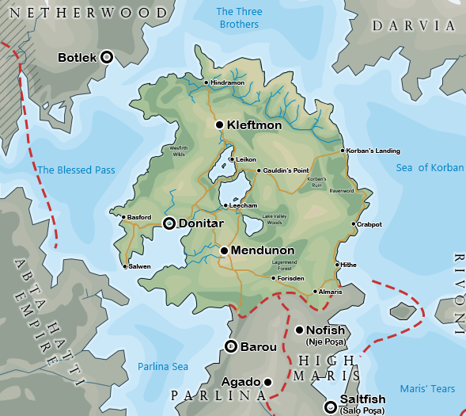

# Korbantir

{ align=right loading=lazy }

Korbantir is a sovereign country at the north-most tip of the peninsula between the five central seas of Bhreia. It is bordered by both Parlina and High Maris.

[Click here for a full-sized map.](../../assets/images/korbantir-map-full.png)

## History

TODO

## Geography

TODO

## Demographics

TODO

### Settlements

TODO