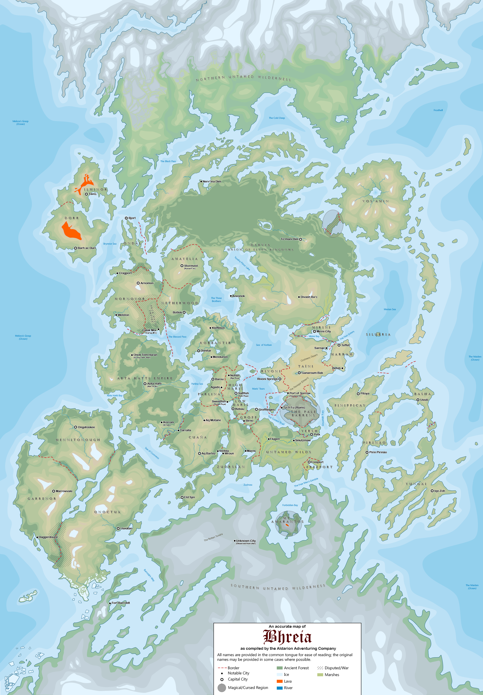

---
categories:
    - Meta
    - Character Creation
---
# Welcome to Bhreia

<figure class="infobox right">
  <h3>Bhreia</h3>
  
  <figcaption>
    The world of Bhreia. Click the image to download a high-resolution version.
  </figcaption>
</figure>

Bhreia (bray-ah) is a fantasy setting created for use with TTRPGs. If you were guided here by your DM, know that this documentation is a supplemental resource to the official documentation and is **not required** reading. Instead, it's a resource empowering you to create a character more integrated with the setting by providing details to riff off.

This wiki also keeps track of the [[braving-bhreia]] campaign run by its author.

Almost everything presented here is **common knowledge** to anyone living in this setting.

## Getting Started

* [[setting-overview]]
* [[picking-country|Picking a country for your race]].
* [[calendar|How the calendar works in this world]].
* [[timeline|Important historical events]].

## World Map

To get a copy of the complete world map, [**click here**](assets/images/world-map-full.png). This map is a continual work in progress and will change over time. For maps of individual regions or countries, see their respective pages.

## DM Specific Content

Beware of content explicitly marked with a **DM** prefix, a lock icon 🔐, a blurred-out page, or a collapsible section.
Some page titles are also scrambled since they can potentially spoil the story. Above the navigation is a button that allows you to undo this.

??? danger "DM: An example."
    Reading the information in these sections will 100% spoil your game.

These pages are meant for the DM only and intended for them to reveal at their discretion.

## Contributing

If you want to add or change anything, feel free to follow the "contributing" section in the readme for this wiki's repository, [located here on GitHub](https://github.com/EddyLuten/bhreia.com/).
